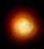
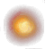

# SHP2Bmp.exe
SHP文件转换

# SPE.exe
PAK文件转换

# 居然floor是tga格式的

# pillow
1.Image Module（from PIL import Image）

Image.open(fp)--fp可以是文件名，也可是file object，但是必须是以'r'模式打开的。最后返回一个Image 对象

Image.blend(im1,im2,alpha) --返回一个融合后的Image对象,out=im1*(1-alpha)+im2*alpha

Image.composite(im1,im2,mask)--返回一个融合后的Image对象,out由透明遮罩mask和原始im1,im2决定,mask模式为'1','L'或'RGBA'

L模式下：out=im1*L/255+im2*(1-L/255)

RGBA模式下：out=im1*mask+im2*(1-mask)，mask的值由mask图像在该点是否为空及alpha值决定

详见练习的代码

--使用RGBA模式的mask(ImageDraw画出矩形或圆形等局部图形)可以实现局部透明度的变化

blend方法要想实现局部透明度变化只能crop,paste

<b style="color:red">
Image.eval(im,func) --func为接受一个整数参数的函数，将im的每个像素值分别传给func处理并返回最后的Image对象
</b>

Image.new(mode,size,color=0) --创建一个新对象，mode为单通道时，color为一个整数或浮点数；

多通道时，color为元组，元素数目对应通道数。

Image.fromarray(obj,mode=None) --从含有array interface 的其他对象创建Image对象

Image.merge(mode,bands) --融合多个通道图像

Image 对象的属性（im=Image.open(fp)）

im.mode--如'L','RGB'等

im.size--（200,300）

im.format --如'JPEG'

im.info 、im.palette

Image 对象的方法（im=Image.open(fp)）

im.convert(mode)--转换模式，如'L','RGB'

im.copy() --复制，不影响原图像

im.crop(box) --复制一部分图像，box为一个元组，定义矩形的左上角和右下角。改变原图像，可能会也可能不会影响crop的部分，

如果想使复制的部分脱离原图像的影响，对crop后的部分采用load方法

im.getbands() --返回一个包含各通道名称的元组

im.getbbox() --返回非空边界矩形，左上点和右下点

im.getdata() --返回一个扁平化的图像像素序列（PIL内在类型），之后需要使用list()方法将其转化为python语言的序列

im.getextrema() --返回每个通道中像素值得(min,max)值

im.getpixel((x,y)) --返回(x,y)处的像素值

im.histogram() --返回直方图统计数据

im.paste(im1,box=None)--将im1粘贴到im上，box默认为None，表示从(0,0)开始粘贴，也可以设置为其他二元元组或四元元组

设置为四元元组时，im1的大小必须和box表示的矩形大小一样。另外，'RGBA'模式的alpha将被忽视

im.resize(size,resample=0) --调整大小，resample有四个选项，默认为第一个，第四个质量更高一些

Image.NEAREST：nearest neighbour

Image.BILINEAR：linear interpolation

Image.BICUBIC：cubic spline interpolation

Image.LANCZOS：a high-quality downsa

mpling filter

im.rotate(degrees,resample=0,expand=0) --逆时针旋转某一度数，resample有三个选项，默认第一个；expand默认为0，

保持旋转后图像和原来大小相同，超出边界的部分舍掉，设置为True则扩展图像大小以保证能全部显示原图像的内容

im.save(fp,format=None) --保存图像

im.show(title=None) --调试时常用来显示图像

im.split() --分离通道，返回分离后的通道元组

im.transpose(method)--旋转图像，method有：Image.FLIP_LEFT_RIGHT 左右颠倒

Image.FLIP_TOP_BOTTOM 上下颠倒

Image.ROTATE_90 逆时针旋转90度

Image.ROTATE_180 逆时针旋转180度

Image.ROTATE_270 逆时针旋转 270度

Image.TRANSPOSE 上下左右颠倒

im.load() --分配图像存储空间，载入像素数据，一般open得到的对象会自动调用，无需手动调用

因为此方法会使图像对象和原文件断绝联系，故在im.crop()后可用于切断复制部分与原图像的联系

2.ImgaeFont Module (from PIL import ImageFont)

ImageFont.load(filename) --加载字体文件，返回一个font对象

ImageFont.load_path(filename) --加载字体文件，会沿着Python Path寻找

ImageFont.truetype(font=None,size=10,index=0) --加载TrueType或opentype类型的字体文件，返回一个size大小的font对象

当前目录没有该文件则去windows的fonts目录下查找

index决定加载哪个font face(一个字体文件可能会包含多个相关的字体)

ImageFont对象方法(font=ImageFont.load(f)):

font.getsize(text)--返回text在当前字体下的大小

3.ImageColor Module (from PIL import ImageColor)

ImageColor.getrgb(color) --将字符串形式的color转换为rgb的形式，即(r,g,b[,a])

ImageColor.getcolor(color,mode) --将字符串形式的color转换为rgb或greyscale的形式

mode是color(如’RGB')，则返回(r,g,b[,a]);不是color（如'L'）则返回(graylevel[,a])

该模块支持的color字符串的形式有以下几种：

(1)十六进制形式，#rgb或者#rrggbb,如#00ff00,#0b1

(2)RGB Function，如rgb(255,0,0)或者rgb(100%,0%,20%)

(3)HSL模式，如hsl(0,20%,100%),hsl(360,0%,100%)

(4)HTML颜色，如'red','Red'

4.ImageDraw Module (from PIL import ImageDraw)

ImageDraw.Draw(im) --返回一个绘图对象，使以后的绘图操作发生在im上

Draw对象方法(draw=ImageDraw.Draw(im)):

注:无特殊说明，参数box类型默认为[x,y,x,y]或[(x,y),(x,y)];xy参数类型默认为[x,y,x,y,x,y...]或者[(x,y),(x,y),(x,y),...]

draw.arc(box,start,end,fill=None) --start定义起始角度(0代表3点钟方向),end定义终止角度，都为degrees,正方向为顺时针。

draw.chord(box,start,end,fill=None,outline=None) --类似arc，但是连接首尾端

点，fill为填充颜色，outline为描边颜色

draw.ellipse(box,fill=None,outline=None) --画一个椭圆

draw.line(xy,fill=None,width=0) --直线

draw.pieslice(box,start,end,fill=None,outline=None) --画一个扇形

draw.points(xy,fill=None) --点

draw.polygon(xy,fill=None,outline=None) --画一个多边形

draw.rectangle(box,fill=None,outline=None) --矩形

draw.text(xy,text,fill=None,font=None) --xy为左上点位置，font为ImageFont对象

draw.textsize(text,font=None) --返回text在font字体下的大小


###去黑底
> 此算法有灵界的感觉~~~

->

```
package 
{
        import flash.display.Bitmap;
        import flash.display.BitmapData;
        import flash.display.Sprite;
        import flash.events.Event;
        import flash.utils.ByteArray;
        
        /**
         * ...
         * @author sailor
         */
        [SWF(backgroundColor=0x550055)]
        public class Main extends Sprite 
        {
                
                [Embed(source = '../lib/2.jpg')]
        
                public var bmp:Class;
                public function Main():void 
                {
                        var bmpd:BitmapData = Bitmap(new bmp()).bitmapData;
                        
                        var newbmpd:BitmapData = new BitmapData(bmpd.width, bmpd.height, true, 0);
                        var buffer:ByteArray = bmpd.getPixels(bmpd.rect);
                        
                        buffer.position = 0;
                        for (var i:int = 0, len:int = buffer.length ; i < len; i += 4 )
                                buffer[i] = (buffer[i + 1] + buffer[i + 2] + buffer[i + 3]) / 3;

                        newbmpd.setPixels(bmpd.rect, buffer);
                        
                        addChild(new Bitmap(newbmpd));
                        
                }
                
                
        }
        
}
```

###去白底
```
for (var y:int = 0;y < bd.height;y++)
{
        for (var x:int = 0;x < bd.width;x++)
        {
                var color:uint = bd.getPixel32(x, y);
                var a:uint = (color >> 24) & 0x000000FF;
                var r:uint = (color >> 16) & 0x000000FF;
                var g:uint = (color >> 8) & 0x000000FF;
                var b:uint = (color >> 0) & 0x000000FF;
                a = Math.max(r, g, b);

                var h:Number = Math.max(r, g, b) / 255 ;
                r = Math.round(r / h);
                g = Math.round(g / h);
                b = Math.round(b / h);
                color = (a << 24) | (r << 16) | (g << 8) | (b << 0);

                bd.setPixel32(x, y, color);
        }
}
```

